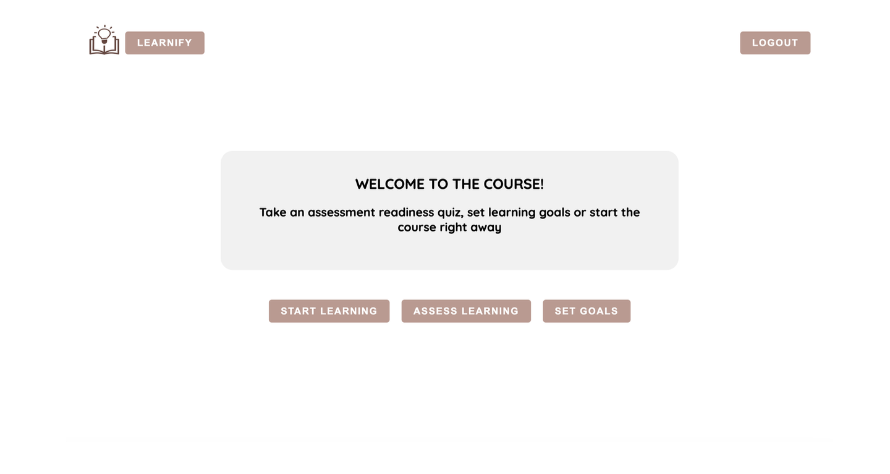
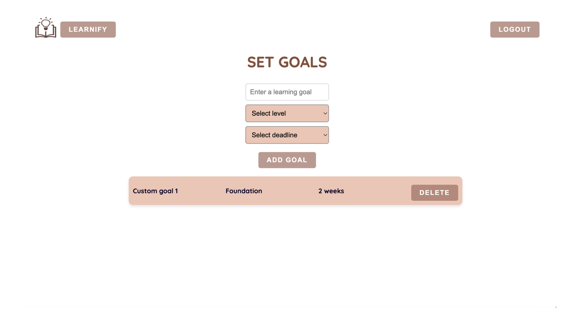
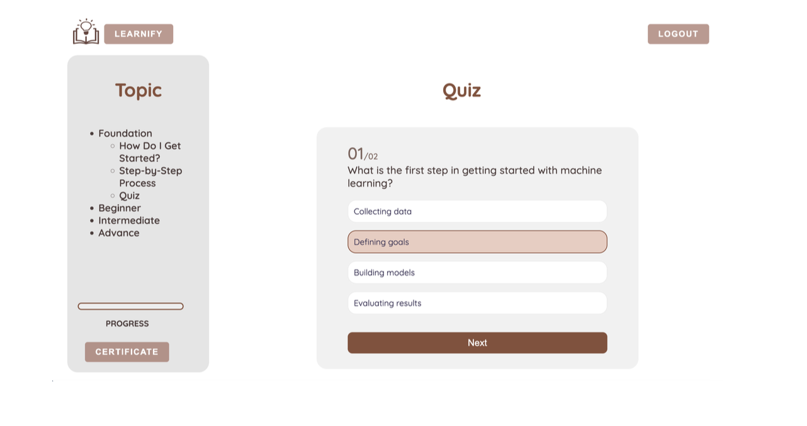
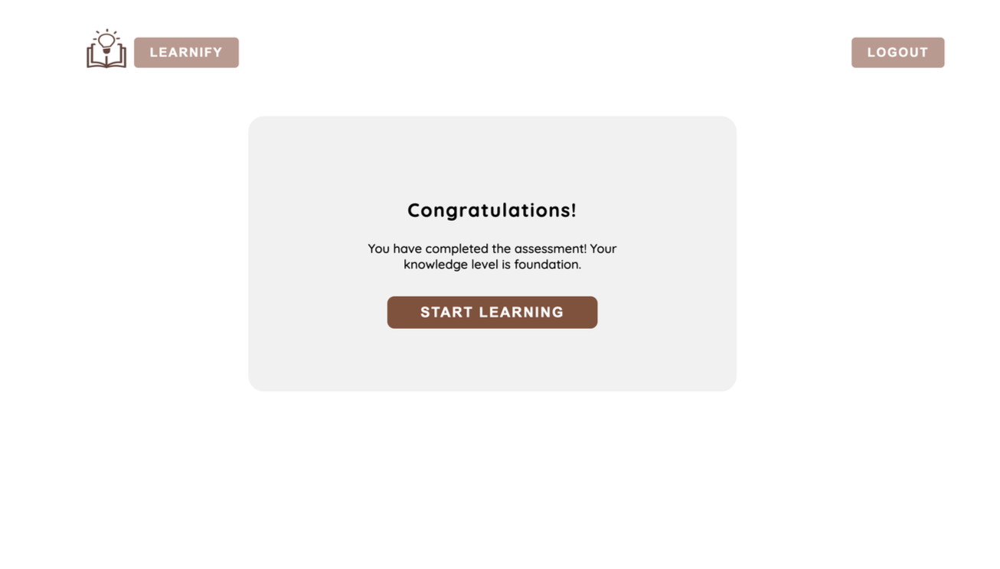

# 👨‍💻 Self-Directed Learning Web Application (MERN)



<div align="center">
  <h3 align="center">Interactive Platform to Learn Computer Science Concepts – Personalised, Gamified and Trackable</h3>
  <div>
    
    
    
    
    
    
  </div>
</div>

---

## 📋 Table of Contents

1. [Tech Stack](#️-tech-stack)
2. [Features](#️-features)
3. [Quick Start](#️-quick-start)
4. [Screenshots](#️-screenshots)
5. [Deployment](#️-deployment)
6. [Future Work](#️-future-work)
7. [Useful Links](#️-useful-links)

---

## ⚙️ Tech Stack

- **MongoDB** – NoSQL database for flexible, scalable data storage  
- **Express.js** – Backend web framework for RESTful APIs  
- **React** – Frontend library for interactive UI  
- **Node.js** – Server-side JavaScript runtime  
- **TypeScript** – Type-safe language for backend code  
- **Mongoose** – ODM for MongoDB  
- **Axios** – Handles HTTP requests from client to server  
- **JWT Authentication** – Secure user login and session handling

---

## ⚡️ Features

- 🔐 **User Authentication**  
  Secure registration, login and logout using JWT tokens  

- 🧠 **Readiness Assessment Quiz**  
  Initial quiz evaluates user level: Foundation → Beginner → Intermediate → Advanced  

- 🎯 **Goal Setting**  
  Set learning goals with personal deadlines  

- 📚 **Structured ML Content**  
  Four levels of curated content with visuals and code snippets  

- 📝 **Quizzes & Evaluation**  
  Track understanding with quizzes and instant feedback  

- 📊 **Progress Tracking**  
  Visual progress bar and historical score tracking  

- 🎓 **Certificate Generation**  
  Auto-generate personalised certificates after course completion  

- 📖 **Built-in User Guide**  
  Integrated help section for seamless onboarding  

---

## 👌 Quick Start

### 🛠️ Prerequisites

- [Node.js](https://nodejs.org/)
- [MongoDB](https://www.mongodb.com/)
- [Git](https://git-scm.com/)

---

### 🧰 Installation Instructions

1. **Open the project directory**  
   Open the folder containing both `client` and `server` directories in your terminal (or Command Prompt on Windows).

2. **Set up the server (backend) files**
   ```bash
   cd server
   npm install
   ```
   This will install all necessary dependencies for the backend.

3. **Set up the client (frontend) files**
   - Open a new terminal window or tab, or navigate back to the root folder.
   ```bash
   cd client
   npm install
   ```
   This installs all required dependencies for the frontend.

4. **Verify Installation**
   - Make sure `node_modules` folders exist in both the `client` and `server` directories.
   - This indicates that the packages have been successfully installed.

5. **Start the backend server**
   ```bash
   cd server
   npm run dev
   ```

6. **Start the frontend server**
   ```bash
   cd client
   npm start
   ```
   This launches the React development server.

7. **Check the application**
   - The app should automatically open in your default web browser.
   - If it doesn’t, visit: [http://localhost:3000](http://localhost:3000)

8. **Running both servers simultaneously**
   - With both frontend and backend running, the application should be fully functional, and the client should communicate seamlessly with the server.

---

## 🖼️ Screenshots


  
*Setting Goals*

  
*Interactive quiz module with immediate feedback*

  
*ML readiness assessment*


---

## ☁️ Deployment

### Deploy Frontend with [Vercel](https://vercel.com)

1. Push frontend code to GitHub  
2. Log in to Vercel and import the GitHub repo  
3. Set build settings (e.g., `npm run build`, output dir: `dist`)  
4. Deploy and get a live URL

### Deploy Backend with [Render](https://render.com) or [Heroku](https://heroku.com)

1. Push backend code to GitHub  
2. Connect repo on Render or Heroku  
3. Set environment variables:
   - `JWT_SECRET`
   - `MONGO_URI`
4. Deploy and test API endpoint

---

## 🔮 Future Work

- 📹 **Video Content**  
  Embed tutorials and explanations for ML topics  

- 💻 **Integrated Code Editor**  
  Run Python and JS snippets directly in the app  

- 👥 **Community Forums**  
  Discussion boards for peer support and Q&A  

- 🤖 **Personalized Learning Paths**  
  Smart suggestions based on user performance  

- 🔗 **Social Integration**  
  Link profiles with GitHub, LinkedIn for certification sharing  

---

## 🔗 Useful Links

- [React Documentation](https://reactjs.org/)
- [Express.js Docs](https://expressjs.com/)
- [MongoDB Docs](https://www.mongodb.com/docs/)
- [Node.js Docs](https://nodejs.org/en/docs)
- [TypeScript Docs](https://www.typescriptlang.org/docs/)
- [JWT Intro](https://jwt.io/introduction)

---
